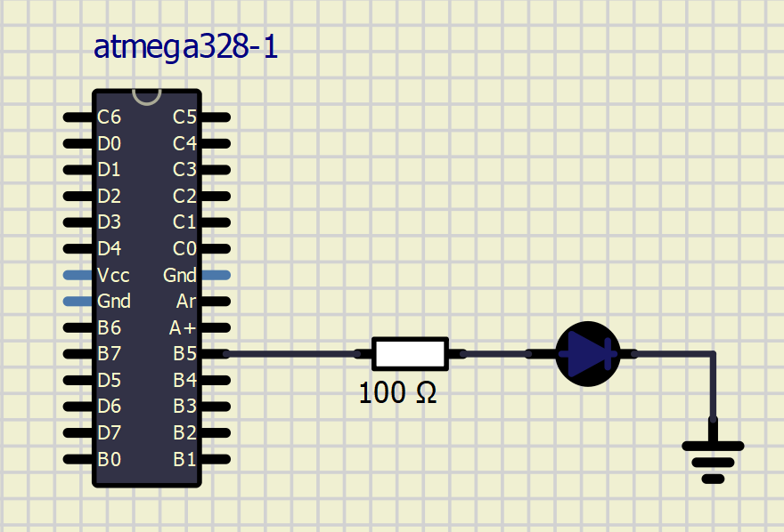

# Lab 1: Zdeňka Varmužová

Link to your `Digital-electronics-2` GitHub repository:

   [https://github.com/zvarmuzova/Digital-electronics-2](https://github.com/zvarmuzova/Digital-electronics-2)


### Blink example

1. What is the meaning of the following binary operators in C?
   * `|` or
   * `&` and
   * `^` xor
   * `~` not
   * `<<` bit shift (left)
   * `>>` bit shift (right)

2. Complete truth table with operators: `|`, `&`, `^`, `~`

| **b** | **a** |**b or a** | **b and a** | **b xor a** | **not b** |
| :-: | :-: | :-: | :-: | :-: | :-: |
| 0 | 0 | 0 | 0 | 0 | 1 |
| 0 | 1 | 1 | 0 | 1 | 1 |
| 1 | 0 | 1 | 0 | 1 | 0 |
| 1 | 1 | 1 | 0 | 0 | 0 |


### Morse code

1. Listing of C code with syntax highlighting which repeats one "dot" and one "comma" on a LED:

```c
int main(void)
{
    // Set pin as output in Data Direction Register
    // DDRB = DDRB or 0010 0000
    DDRB = DDRB | (1<<LED_GREEN);

    // Set pin LOW in Data Register (LED off)
    // PORTB = PORTB and 1101 1111
    PORTB = PORTB & ~(1<<LED_GREEN);

    // Infinite loop
    while (1)
    {
        // Pause several milliseconds
        _delay_ms(SHORT_DELAY);

        // Invert LED in Data Register		LONG ON
        // PORTB = PORTB xor 0010 0000
        PORTB = PORTB ^ (1<<LED_GREEN);

        _delay_ms(4*SHORT_DELAY);

        PORTB = PORTB ^ (1<<LED_GREEN);   //OFF
        
        _delay_ms(SHORT_DELAY);
        
        PORTB = PORTB ^ (1<<LED_GREEN);   //SHORT ON
        
        _delay_ms(SHORT_DELAY);

        PORTB = PORTB ^ (1<<LED_GREEN);   //OFF
    }

    // Will never reach this
    return 0;
}
```


2. Scheme of Morse code application, i.e. connection of AVR device, LED, resistor, and supply voltage. The image can be drawn on a computer or by hand. Always name all components and their values!

   