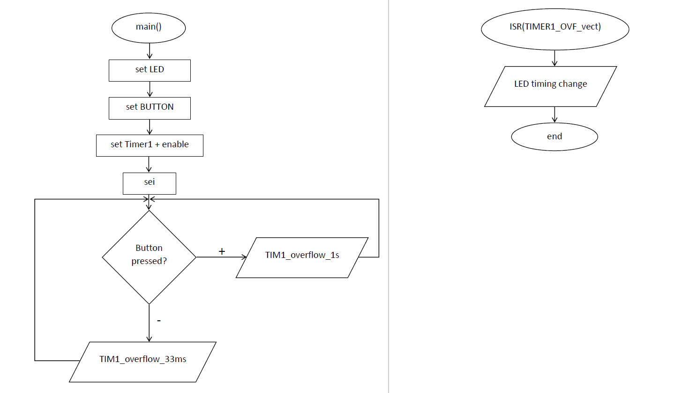
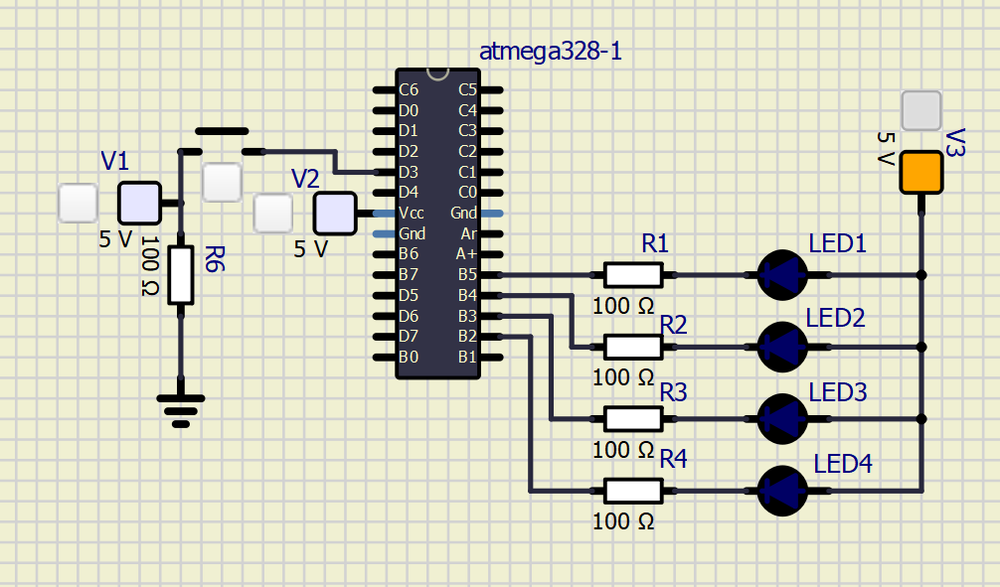

# Lab 4: Zdeňka Varmužová

Link to your `Digital-electronics-2` GitHub repository:

   [https://github.com/zvarmuzova/Digital-electronics-2](https://github.com/zvarmuzova/Digital-electronics-2)


### Overflow times

1. Complete table with overflow times.

| **Module** | **Number of bits** | **1** | **8** | **32** | **64** | **128** | **256** | **1024** |
| :-: | :-: | :-: | :-: | :-: | :-: | :-: | :-: | :-: |
| Timer/Counter0 | 8  | 16u | 128u | -- | 1 024u | -- | 4,096m | 16,384m |
| Timer/Counter1 | 16 | 4,096m | 32,768m | -- | 262 144u | -- | 1,048 576s | 4,194 304s |
| Timer/Counter2 | 8  | 16u | 128u | 512u | 1,024m | 2,048m | 4,096m | 16,384m|


### Timer library

1. In your words, describe the difference between common C function and interrupt service routine.
   * Function 
        - set of statements - take input(s) -> do some code -> produce output(s)
        - is called by program
   * Interrupt service routine 
        - when the interrupt occurs running program is paused -> starts ISR -> program continues where it was
        - is called whenever an interrupt occurs
        

2. Part of the header file listing with syntax highlighting, which defines settings for Timer/Counter0:

```c
/**
 * @name  Definitions of Timer/Counter0
 * @note  F_CPU = 16 MHz
 */
/** @brief Stop timer, prescaler 000 --> STOP */
#define TIM0_stop()           TCCR0B &= ~((1<<CS12) | (1<<CS11) | (1<<CS10));
/** @brief Set overflow 16us, prescaler 001 --> 1 */
#define TIM0_overflow_16us()   TCCR0B &= ~((1<<CS12) | (1<<CS11)); TCCR0B |= (1<<CS10);
/** @brief Set overflow 128us, prescaler 010 --> 8 */
#define TIM0_overflow_128us()  TCCR0B &= ~((1<<CS12) | (1<<CS10)); TCCR0B |= (1<<CS11);
/** @brief Set overflow 1ms, prescaler 011 --> 64 */
#define TIM0_overflow_1ms() TCCR0B &= ~(1<<CS12); TCCR0B |= (1<<CS11) | (1<<CS10);
/** @brief Set overflow 4ms, prescaler 100 --> 256 */
#define TIM0_overflow_4ms()    TCCR0B &= ~((1<<CS11) | (1<<CS10)); TCCR0B |= (1<<CS12);
/** @brief Set overflow 16ms, prescaler // 101 --> 1024 */
#define TIM0_overflow_16ms()    TCCR0B &= ~(1<<CS11); TCCR0B |= (1<<CS12) | (1<<CS10);
/** @brief Enable overflow interrupt, 1 --> enable */
#define TIM0_overflow_interrupt_enable()  TIMSK1 |= (1<<TOIE1);
/** @brief Disable overflow interrupt, 0 --> disable */
#define TIM0_overflow_interrupt_disable() TIMSK1 &= ~(1<<TOIE1);
```

3. Flowchart figure for function `main()` and interrupt service routine `ISR(TIMER1_OVF_vect)` of application that ensures the flashing of one LED in the timer interruption. When the button is pressed, the blinking is faster, when the button is released, it is slower. Use only a timer overflow and not a delay library. The image can be drawn on a computer or by hand. Use clear descriptions of the individual steps of the algorithms.

   


### Knight Rider

1. Scheme of Knight Rider application with four LEDs and a push button, connected according to Multi-function shield. Connect AVR device, LEDs, resistors, push button, and supply voltage. The image can be drawn on a computer or by hand. Always name all components and their values.

   