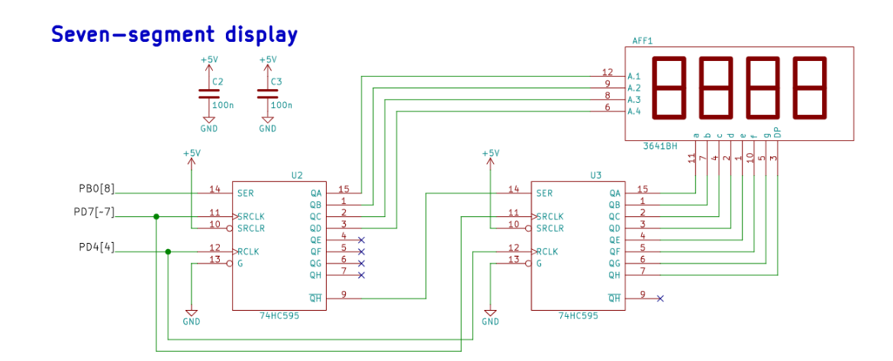

# Preparation task
1. Read the [7-segment display tutorial](https://www.electronics-tutorials.ws/blog/7-segment-display-tutorial.html) and find out what is the difference between:
   * Common Cathode 7-segment display (CC SSD) - Leds (segments) are active high; all leds are joined together to ground (logic 0)
   * Common Anode 7-segment display (CA SSD) - Leds (segments) are active low; all leds are joined together to +V (logic 1)

2. In the following table, write the binary values of the segments for display 0 to 9 on a common anode 7-segment display.

   | **Digit** | **A** | **B** | **C** | **D** | **E** | **F** | **G** | **DP** |
   | :-: | :-: | :-: | :-: | :-: | :-: | :-: | :-: | :-: |
   | 0 | 0 | 0 | 0 | 0 | 0 | 0 | 1 | 1 |
   | 1 | 1 | 0 | 0 | 1 | 1 | 1 | 1 | 1 |
   | 2 | 0 | 0 | 1 | 0 | 0 | 1 | 0 | 1 |
   | 3 | 0 | 0 | 0 | 0 | 1 | 1 | 0 | 1 |
   | 4 | 1 | 0 | 0 | 1 | 1 | 0 | 0 | 1 |
   | 5 | 0 | 1 | 0 | 0 | 1 | 0 | 0 | 1 |
   | 6 | 0 | 1 | 0 | 0 | 0 | 0 | 0 | 1 |
   | 7 | 0 | 0 | 0 | 1 | 1 | 1 | 1 | 1 |
   | 8 | 0 | 0 | 0 | 0 | 0 | 0 | 0 | 1 |
   | 9 | 0 | 1 | 1 | 1 | 0 | 0 | 0 | 1 |

3. Use schematic of the [Multi-function shield](../../Docs/arduino_shield.pdf) and find out the connection of seven-segment display. What is the purpose of two shift registers 74HC595?

Two shift registers are used, because we have 4 seven-segment displays, so we need to switch betveen displays (first register) and control output of leds (second display).

