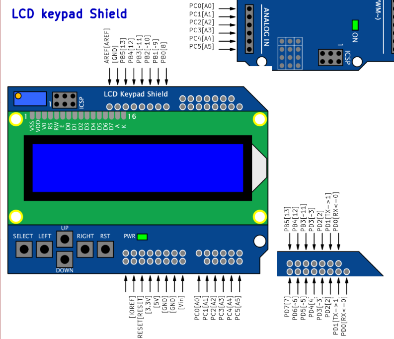
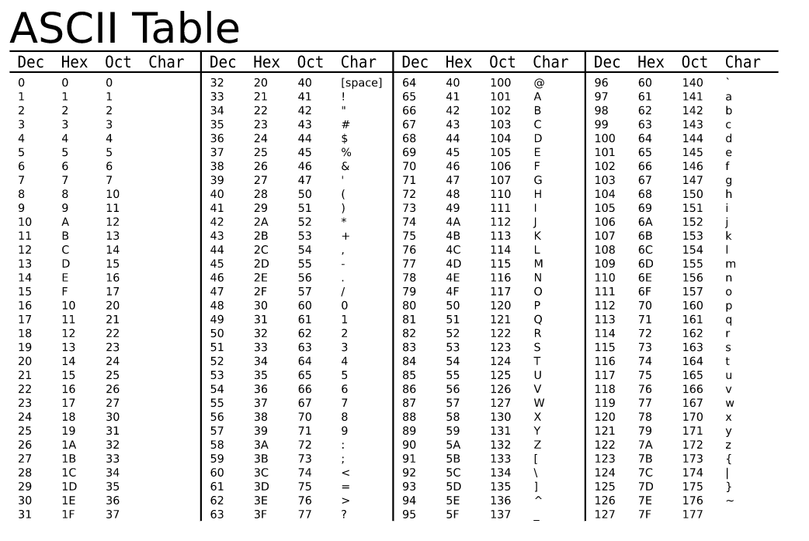

# Preparation task
Use schematic of the [LCD keypad shield](../../Docs/arduino_shield.pdf) and find out the connection of LCD display. What data and control signals are used? What is the meaning of these signals?

&nbsp;

&nbsp;

&nbsp;

&nbsp;

&nbsp;

&nbsp;

   | **LCD signal(s)** | **AVR pin(s)** | **Description** |
   | :-: | :-: | :-- |
   | RS | PB0 | Register selection signal. Selection between Instruction register (RS=0) and Data register (RS=1) |
   | R/W | GND | Read/write data to LCD. 0 -> only write.|
   | E | PB1 |  |
   | D[3:0] | GND |  |
   | D[7:4] | PD[7:4] |  |

What is the ASCII table? What are the codes/values for uppercase letters `A` to `Z`, lowercase letters `a` to `z`, and numbers `0` to `9` in this table?

   | **Char** | **Decimal** | **Hexadecimal** |
   | :-: | :-: | :-: |
   | `A` | 65 | 0x41 |
   | `B` |  |  |
   | ... |  |  |
   | `a` | 97 | 0x61 |
   | `b` |  |  |
   | ... |  |  |
   | `0` | 48 | 0x30 |
   | `1` |  |  |
   | ... |  |  |

   | **Function name** | **Function parameters** | **Description** | **Example** |
   | :-- | :-- | :-- | :-- |
   | `lcd_init` | `LCD_DISP_OFF` `LCD_DISP_ON` `LCD_DISP_ON_CURSOR` `LCD_DISP_ON_CURSOR_BLINK` | Display off&nbsp;&nbsp;&nbsp;&nbsp;&nbsp;&nbsp;&nbsp;&nbsp;&nbsp;&nbsp;&nbsp;&nbsp;&nbsp;&nbsp;&nbsp;&nbsp;&nbsp;&nbsp;&nbsp;&nbsp;&nbsp;&nbsp;&nbsp;&nbsp;&nbsp;&nbsp;&nbsp;&nbsp;&nbsp;&nbsp;&nbsp;&nbsp;&nbsp;&nbsp;&nbsp;&nbsp;&nbsp;&nbsp;&nbsp;&nbsp;&nbsp;&nbsp;&nbsp;&nbsp;&nbsp; &nbsp; &nbsp; &nbsp; | `lcd_init(LCD_DISP_OFF);` &nbsp; &nbsp; &nbsp; |
   | `lcd_clrscr` | | | `lcd_clrscr();` |
   | `lcd_gotoxy` | | | |
   | `lcd_putc` | | | |
   | `lcd_puts` | | | |
   | `lcd_command` | | | |
   | `lcd_data` | | | |