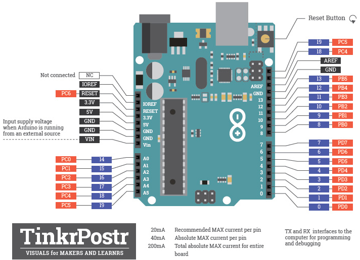
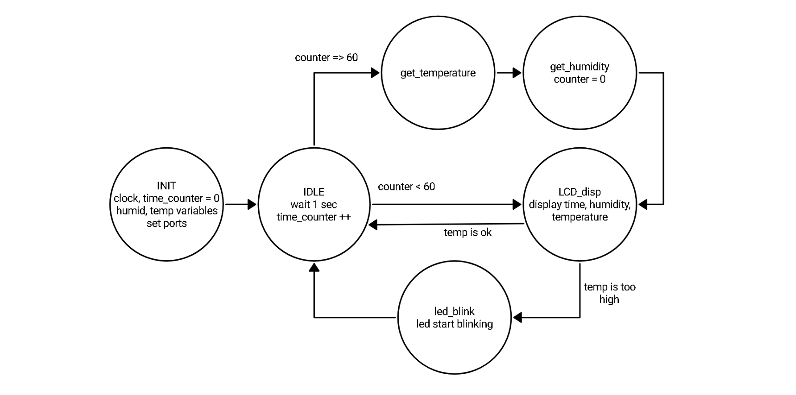

# Lab 8: Zdeňka Varmužová

Link to this file in your GitHub repository:

[https://github.com/zvarmuzova/Digital-electronics-2/tree/main/Labs/08-u2c](https://github.com/zvarmuzova/Digital-electronics-2/tree/main/Labs/08-u2c)

### Arduino Uno pinout

1. In the picture of the Arduino Uno board, mark the pins that can be used for the following functions:
   * PWM generators from Timer0, Timer1, Timer2 - PB3, PB2, PB1, PD6, PD5, PD3
   * analog channels for ADC - PC5, PC4, PC3, PC2, PC1, PC0
   * UART pins - PD4, PD1, PD0
   * I2C pins - PC5, PC4
   * SPI pins - PB5, PB4, PB3, PB2
   * external interrupt pins INT0, INT1 - PD3, PD2

   

### I2C

1. Code listing of Timer1 overflow interrupt service routine for scanning I2C devices and rendering a clear table on the UART.

```c
/**********************************************************************
 * Function: Timer/Counter1 overflow interrupt
 * Purpose:  Update Finite State Machine and test I2C slave addresses 
 *           between 8 and 119.
 **********************************************************************/
ISR(TIMER1_OVF_vect)
{
    static state_t state = STATE_IDLE;  // Current state of the FSM
    static uint8_t addr = 7;            // I2C slave address
    uint8_t result = 1;                 // ACK result from the bus
    char uart_string[2] = "00"; // String for converting numbers by itoa()

    // FSM
    switch (state)
    {
    // Increment I2C slave address
    case STATE_IDLE:
        addr++;
        // If slave address is between 8 and 119 then move to SEND state

        if(addr<120)        // always higher than 7 (we set it at start to 7)
        {
            state = STATE_SEND;
        }
        else addr = 7;
        break;
    
    // Transmit I2C slave address and get result
    case STATE_SEND:
        // I2C address frame:
        // +------------------------+------------+
        // |      from Master       | from Slave |
        // +------------------------+------------+
        // | 7  6  5  4  3  2  1  0 |     ACK    |
        // |a6 a5 a4 a3 a2 a1 a0 R/W|   result   |
        // +------------------------+------------+
        result = twi_start((addr<<1) + TWI_WRITE);
        twi_stop();
        /* Test result from I2C bus. If it is 0 then move to ACK state, 
         * otherwise move to IDLE */
        switch(result)
        {
            case(0):
                state = STATE_ACK;
                break;
            default:
                state = STATE_IDLE;
        }

        break;

    // A module connected to the bus was found
    case STATE_ACK:
        // Send info about active I2C slave to UART and move to IDLE
        uart_puts("Addr: ");
        itoa(addr, uart_string, 16);
        uart_puts(uart_string);
        uart_puts("\r\n");
        
        state = STATE_IDLE;
        break;

    // If something unexpected happens then move to IDLE
    default:
        state = STATE_IDLE;
        break;
    }
}
```

2. (Hand-drawn) picture of I2C signals when reading checksum (only 1 byte) from DHT12 sensor. Indicate which specific moments control the data line master and which slave.

   

### Meteo station

Consider an application for temperature and humidity measurement and display. Use combine sensor DHT12, real time clock DS3231, LCD, and one LED. Application display time in hours:minutes:seconds at LCD, measures both temperature and humidity values once per minut, display both values on LCD, and when the temperature is too high, the LED starts blinking.

1. FSM state diagram picture of meteo station. The image can be drawn on a computer or by hand. Concise name of individual states and describe the transitions between them.

   